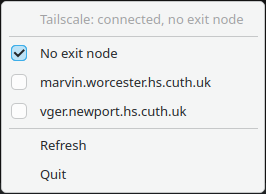
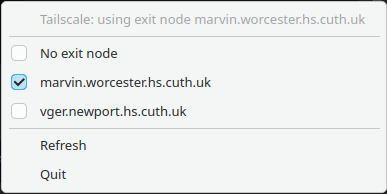

# Tailscale Exit Node Tray

Switch Tailscale exit nodes from your KDE Plasma tray instead of typing `tailscale set --exit-node=...` by hand.

This app adds a small Plasma tray icon with three clear states:

- not connected to a tailnet
- connected to a tailnet, with no exit node
- connected to an exit node

Right click the tray icon to see available exit nodes, switch between them, or disable the current exit node.

## Why use it?

- Faster than opening a terminal for common exit-node changes
- Easy to see whether you are using an exit node at a glance
- Shows the currently active exit node directly in the tray menu
- Built for KDE Plasma 6 with a minimal footprint

## Quick start

Requirements:

- KDE Plasma 6
- `tailscale` already installed
- Python 3
- PyQt6
- passwordless `sudo` for the exact `tailscale set --exit-node=...` commands this app needs

Run it directly:

```bash
python3 ./tailscale_exit_node_tray.py
```

Install it for your user:

```bash
./install.sh
```

On Plasma/Wayland, open the tray menu with right click on the tray icon.

## Screenshots

**Tray state: not connected to a tailnet**


**Tray state: connected, no exit node selected**


**Tray state: connected to an exit node**


**Tray menu with available exit nodes**



**Tray menu with the active exit node checked**



## Features

- Polls Tailscale status and keeps the tray state up to date
- Lists available exit nodes from `tailscale exit-node list`
- Marks the current exit node in the menu
- Lets you clear the current exit node with `No exit node`
- Gives friendly feedback when `sudo` is not configured or Tailscale is unavailable
- Prevents duplicate tray instances

## Install

Install the launcher and executable for the current user:

```bash
./install.sh
```

This installs:

- `~/.local/bin/tailscale-exit-node-tray`
- `~/.local/share/applications/tailscale-exit-node-tray.desktop`
- `~/.local/share/icons/hicolor/scalable/apps/tailscale-exit-node-tray.svg`

After that, launch `Tailscale Exit Node Tray` from Plasma's application launcher.

## Sudo setup

The app only needs `sudo` for:

- `tailscale set --exit-node=`
- `tailscale set --exit-node=<allowed-target>`

It does not use `sudo` for:

- `tailscale status --json`
- `tailscale exit-node list`

Generate a restrictive sudoers file for the current user and current exit-node list:

```bash
./generate-sudoers.sh > tailscale-exit-node-tray.sudoers
```

Review the generated file:

```bash
less tailscale-exit-node-tray.sudoers
```

Copy it into place:

```bash
sudo cp tailscale-exit-node-tray.sudoers \
    /etc/sudoers.d/"$(id -un)"-tailscale-exit-node-tray
sudo chmod 0440 /etc/sudoers.d/"$(id -un)"-tailscale-exit-node-tray
```

Validate it:

```bash
sudo visudo -cf /etc/sudoers.d/"$(id -un)"-tailscale-exit-node-tray
```

The generated rule is intentionally strict:

- only for the current desktop user
- only for `tailscale set --exit-node=`
- only for the exact exit-node hostnames and IPs currently available

If your tailnet exit nodes change, regenerate and reinstall the sudoers file.

Do not allow `/usr/bin/tailscale *` or `/usr/bin/tailscale set *`.

## Usage

1. Start the app
2. Right click the tray icon
3. Choose an exit node from the menu
4. Select `No exit node` to stop using one

Tray states:

- grey icon: not connected to a tailnet
- blue icon: connected to a tailnet, no exit node selected
- green icon: connected to an exit node

## Troubleshooting

**The tray menu does not open on left click**

Use right click. On Plasma/Wayland, the app intentionally uses right click only.

**Choosing an exit node says sudo is not configured**

Generate and install the sudoers file:

```bash
./generate-sudoers.sh > tailscale-exit-node-tray.sudoers
```

Then copy it into `/etc/sudoers.d/` and validate it with `visudo`.

**The app says Tailscale is not connected**

Check that Tailscale is running and connected to your tailnet:

```bash
tailscale status
```

**Running the app twice shows multiple icons**

Current builds prevent duplicate instances. If you still have an older copy running, stop it and launch the latest installed version:

```bash
pkill -f "tailscale_exit_node_tray.py|tailscale-exit-node-tray" || true
tailscale-exit-node-tray
```

## Uninstall

Remove the installed app for the current user:

```bash
./uninstall.sh
```

This also removes:

- `~/.local/bin/tailscale-exit-node-tray`
- `~/.local/share/applications/tailscale-exit-node-tray.desktop`
- `~/.local/share/icons/hicolor/scalable/apps/tailscale-exit-node-tray.svg`

If you created a sudoers file for this app, remove that too:

```bash
sudo rm -f /etc/sudoers.d/"$(id -un)"-tailscale-exit-node-tray
```

## Files

- `tailscale_exit_node_tray.py` - tray app
- `install.sh` - user install script
- `uninstall.sh` - user uninstall script
- `generate-sudoers.sh` - restrictive sudoers generator
